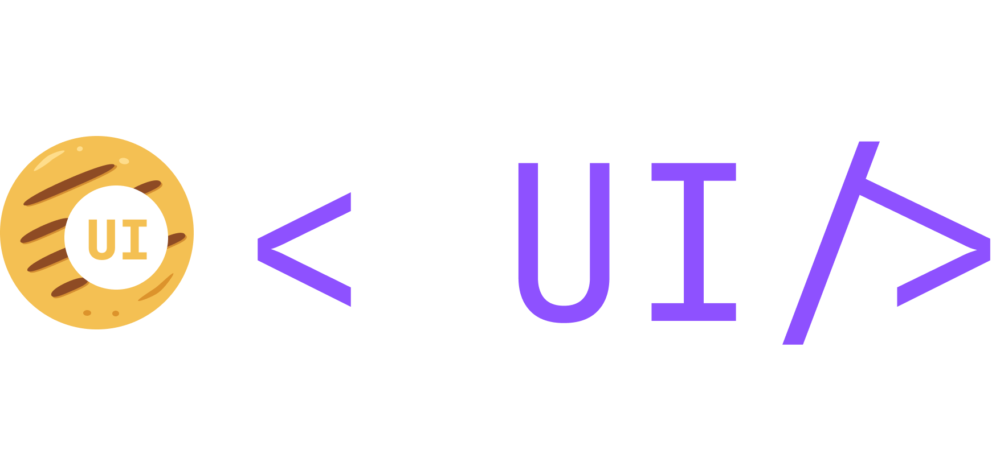

<p align="center">
  <a href="https://github.com/Scr44gr/arepy-ui">
    
  </a>
</p>

<p align="center">
    <em>Modern, fast, declarative UI library for the Arepy game engine.</em>
</p>

<p align="center">
<a href="https://github.com/Scr44gr/arepy-ui/actions" target="_blank">
    
</a>
<a href="https://pypi.org/project/arepy-ui" target="_blank">
    
</a>
<a href="https://pypi.org/project/arepy-ui" target="_blank">
    
</a>
<a href="https://github.com/Scr44gr/arepy-ui/blob/main/LICENSE" target="_blank">
    
</a>
</p>

---

**Documentation**: <a href="https://scr44gr.github.io/arepy-ui" target="_blank">https://scr44gr.github.io/arepy-ui</a>

**Source Code**: <a href="https://github.com/Scr44gr/arepy-ui" target="_blank">https://github.com/Scr44gr/arepy-ui</a>

---

arepy-ui is a modern UI library for building game interfaces with the [Arepy](https://github.com/Scr44gr/arepy) game engine.

Key features:

* **Flexbox Layout**: Familiar CSS-like layout system that just works.
* **Component Library**: Ready-to-use UI components (buttons, sliders, inputs, etc.).
* **Declarative Markup**: Build UIs with HTML-like `.aui` files and CSS-like `.acss` stylesheets.
* **Theme Support**: CSS variables with light/dark theme variants.
* **Drag & Drop**: Built-in drag and drop system.
* **Animations**: Tweening system with easing functions.
* **High Performance**: Cython-accelerated parsing and optimized rendering.

## Installation

```bash
pip install arepy-ui
```

With markup system acceleration:

```bash
pip install arepy-ui[markup]
```

## Example

### Python API

```python
from arepy import ArepyEngine, SystemPipeline
from arepy_ui import UIManager, Node, Text, Button, Style, Color, Unit, JustifyContent, AlignItems

ui_manager: UIManager = None

def setup(game: ArepyEngine):
    global ui_manager
    ui_manager = UIManager.from_engine(game)
    
    ui_manager.set_root(
        Node(
            style=Style(
                width=Unit.percent(100),
                height=Unit.percent(100),
                justify_content=JustifyContent.CENTER,
                align_items=AlignItems.CENTER,
                gap=20,
            ),
            children=[
                Text("Hello, arepy-ui!", font_size=32, color=Color(255, 255, 255)),
                Button("Click me", on_click=lambda: print("Clicked!")),
            ],
        )
    )

def update(game: ArepyEngine):
    ui_manager.update(game.get_delta_time())

def render(game: ArepyEngine):
    ui_manager.render()

if __name__ == "__main__":
    game = ArepyEngine(title="My Game", width=800, height=600)
    world = game.create_world("main")
    world.add_startup_system(setup)
    world.add_system(SystemPipeline.UPDATE, update)
    world.add_system(SystemPipeline.RENDER, render)
    game.set_current_world("main")
    game.run()
```

### Declarative Markup (AUI)

**ui.aui**
```html
<column class="main">
    <text class="title">Hello, arepy-ui!</text>
    <button class="btn" on-click="greet">Click me</button>
</column>
```

**ui.acss**
```css
:root {
    --primary: #6c5ce7;
    --bg: #1a1a2e;
    --text: #ffffff;
}

.main {
    width: 100%;
    height: 100%;
    background: var(--bg);
    justify-content: center;
    align-items: center;
    gap: 20px;
}

.title {
    font-size: 32px;
    color: var(--text);
}

.btn {
    background: var(--primary);
    padding: 12px 24px;
    border-radius: 8px;
    color: var(--text);
}
```

**main.py**
```python
from arepy_ui.markup import load_aui

handlers = {"greet": lambda: print("Hello!")}
result = load_aui("ui.aui", handlers=handlers)
ui_manager.set_root(result.root)
```

## Components

| Component | Description |
|-----------|-------------|
| `Text` | Text rendering with custom fonts |
| `Button` | Clickable button with hover states |
| `TextInput` | Text field with cursor and selection |
| `Checkbox` | Toggle with label |
| `Slider` | Horizontal/vertical value slider |
| `Select` | Dropdown menu |
| `Tabs` | Tabbed container |
| `Image` | Texture display with fit modes |
| `ScrollView` | Scrollable container |
| `ProgressBar` | Progress indicator |
| `Canvas` | Custom drawing surface |
| `Video` | Video playback |
| `ColorPicker` | HSV color selection |
| `Draggable` | Drag and drop support |

## Layout System

arepy-ui uses a **flexbox-based layout** system:

<!-- TODO: Add layout system visualization -->
<!--  -->

```python
Node(
    style=Style(
        flex_direction=FlexDirection.ROW,
        justify_content=JustifyContent.SPACE_BETWEEN,
        align_items=AlignItems.CENTER,
        gap=10,
        padding=Spacing.all(20),
    ),
    children=[
        Button("Save"),
        Button("Cancel"),
    ],
)
```

## Theme Support

Define CSS variables with theme variants:

```css
/* globals.acss */
:root {
    --bg: #1a1a2e;
    --text: #ffffff;
    --accent: #6c5ce7;
}

:root.light {
    --bg: #ffffff;
    --text: #1a1a2e;
    --accent: #5849c2;
}
```

Switch themes at runtime:

```python
from arepy_ui.markup import set_theme

set_theme("light")  # Activate light theme
set_theme(None)     # Return to default
```

<!-- TODO: Add theme switching GIF -->
<!-- <p align="center">
  
</p> -->
<p align="center"><em>Dark and light theme variants</em></p>

## UI Debugger

Built-in visual debugger for inspecting layouts (press F3):

<!-- TODO: Add debugger screenshot -->
<!--  -->

- **F3** - Toggle debugger
- **F4** - Toggle component bounds
- **F5** - Toggle padding visualization
- **F6** - Toggle component tree

## Examples

<!-- TODO: Add GIFs for each example -->
<!--
<table>
<tr>
<td align="center">
<br>
<strong>Components</strong>
</td>
<td align="center">
<br>
<strong>Drag & Drop</strong>
</td>
<td align="center">
<br>
<strong>Inventory</strong>
</td>
</tr>
<tr>
<td align="center">
<br>
<strong>ColorPicker</strong>
</td>
<td align="center">
<br>
<strong>AUI Markup</strong>
</td>
<td align="center">
<br>
<strong>UI Debugger</strong>
</td>
</tr>
</table>
-->
<p align="center"><em>Example GIFs coming soon</em></p>

Run the included examples:

```bash
uv run examples/demo_components.py
uv run examples/demo_drag.py
uv run examples/demo_inventory.py
uv run examples/colorpicker_demo.py
uv run examples/markup_demo/main.py
```

## Performance

The markup parser is **Cython-accelerated** for maximum performance:

```bash
pip install arepy-ui[markup]
python -m arepy_ui.markup.build_ext
```

Falls back to pure Python automatically if Cython isn't available.

## Requirements

* Python 3.10+
* [Arepy](https://github.com/Scr44gr/arepy) game engine
* numpy (for ColorPicker gradients)

## Documentation

Full documentation is available at **[scr44gr.github.io/arepy-ui](https://scr44gr.github.io/arepy-ui)**

* [Getting Started](https://scr44gr.github.io/arepy-ui/getting-started/quickstart/)
* [Components](https://scr44gr.github.io/arepy-ui/components/)
* [Layout](https://scr44gr.github.io/arepy-ui/layout/flexbox/)
* [AUI Markup](https://scr44gr.github.io/arepy-ui/features/markup/)

## Contributing

Contributions are welcome! Please feel free to submit a Pull Request.

## License

This project is licensed under the MIT License - see the [LICENSE](LICENSE) file for details.
