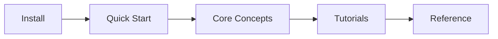

# Learn arepy-ui

Welcome to the arepy-ui learning path! This section will teach you everything you need to know to build beautiful game interfaces.

## Where to Start?

-   :material-download:{ .lg .middle } **Installation**

    ---

    Get arepy-ui installed in your project in under 2 minutes.

    [:octicons-arrow-right-24: Install now](installation.md)

-   :material-rocket-launch:{ .lg .middle } **Quick Start**

    ---

    Create your first UI in 5 minutes with a simple example.

    [:octicons-arrow-right-24: Quick Start](quickstart.md)

-   :material-school:{ .lg .middle } **Your First UI**

    ---

    Step-by-step guide to building a complete UI from scratch.

    [:octicons-arrow-right-24: Tutorial](first-ui.md)

## Learning Path

### 1. Getting Started
Start here if you're new to arepy-ui:

- [Installation](installation.md) - Install the library
- [Quick Start](quickstart.md) - Your first "Hello World"
- [Your First UI](first-ui.md) - Build a complete interface

### 2. Core Concepts
Understand the fundamentals:

- [Understanding Nodes](concepts/nodes.md) - Everything is a Node
- [Styles & Layout](concepts/styles.md) - Flexbox layout system
- [Event Handling](concepts/events.md) - Clicks, hovers, and more

### 3. Tutorials
Learn by building real projects:

- [Building a Game Menu](tutorials/game-menu.md) - Classic main menu
- [Creating an Inventory](tutorials/inventory.md) - Drag & drop system
- [Theme Switching](tutorials/theming.md) - Light/dark modes

## Next Steps

Once you've completed the learning path, check out:

- **[Reference](../reference/index.md)** - Complete API documentation
- **[Resources](../resources/index.md)** - Examples and tools
